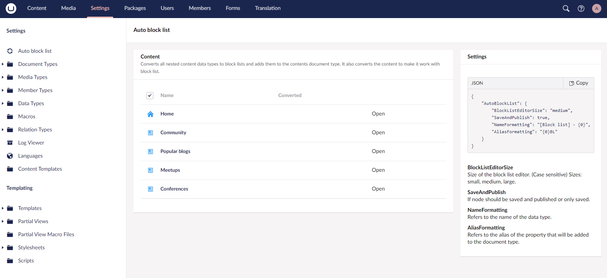
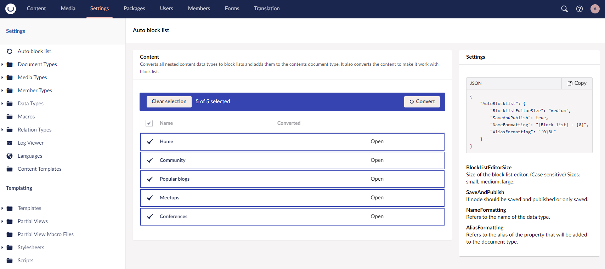
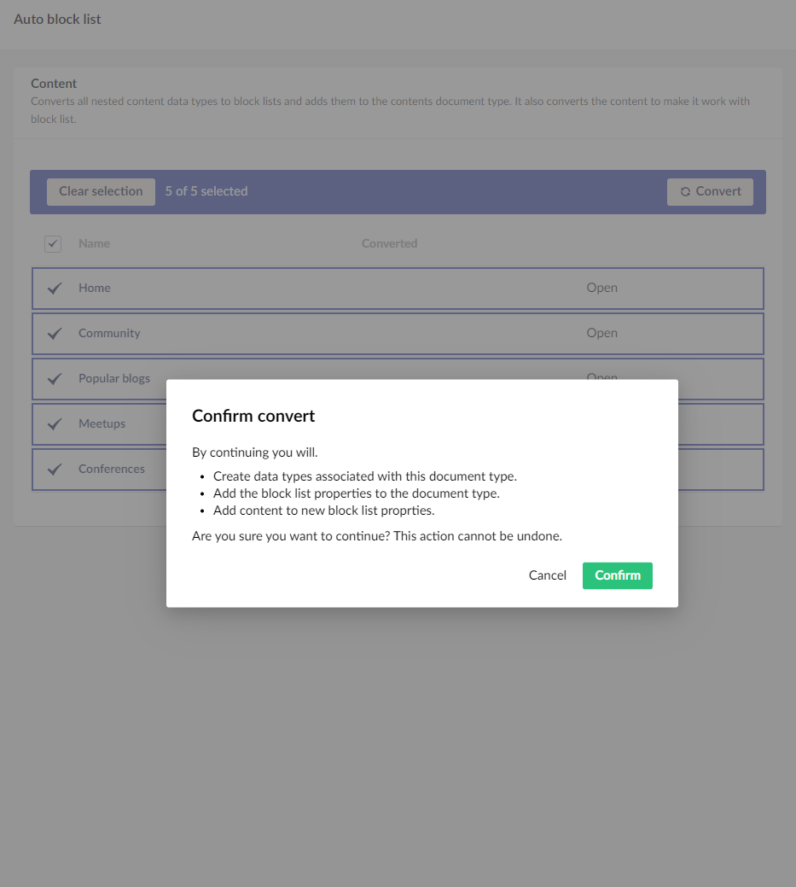
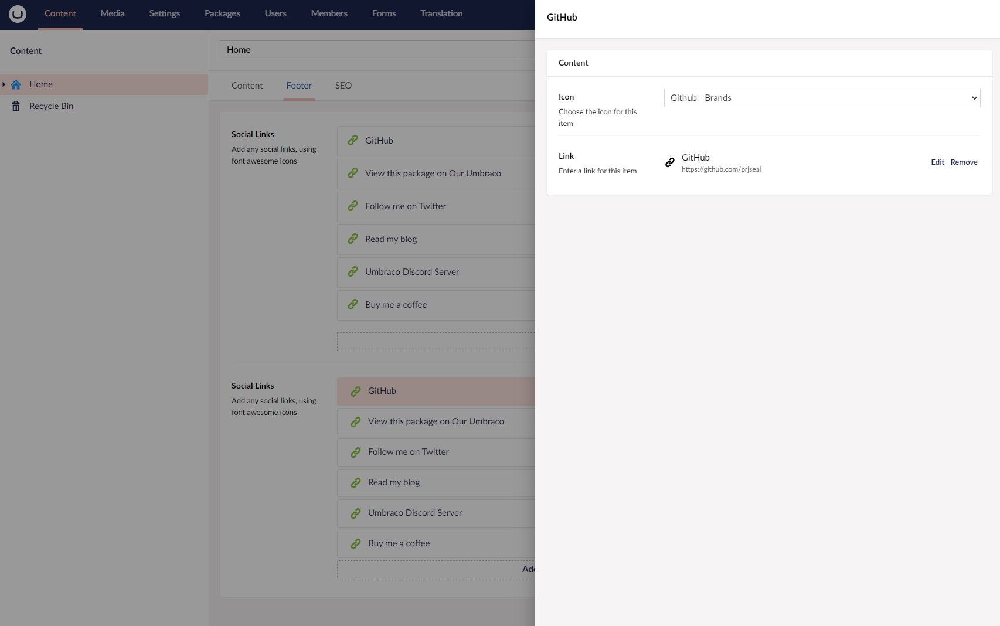
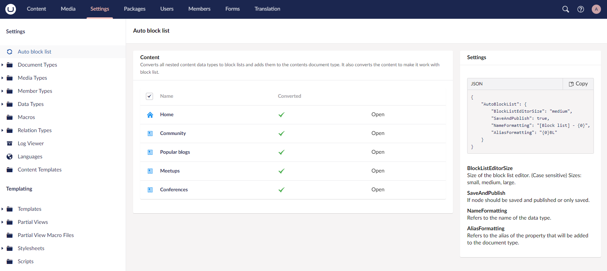

# Auto block list
Auto block list is an Umbraco package made for v10+. Made to help automate the process of converting nested content into an block list. In addition it transfers the content to the new block list format.

## About
With the removal of nested content in Umbraco 13. Uppgrading can potentially be challenging if you us it frequently. That's where Auto block list comes in. With one click AutoBlockLists runs the following workflow.
- Creates the block list data type based on the old nested content data type.
- Adds the new data type to the document type.
- And transfers the content to the newly created block list.

### Settings
```
"AutoBlockList": {
     BlockListEditorSize: "medium",
     SaveAndPublish: true,
     NameFormatting: "[Block list] - {0}",
     AliasFormatting: "{0}BL"
}
```
- ``BlockListEditorSize`` Detirmes the default size when creating a block list data type. Sizes: ``small``, ``medium``, ``large``.
- ``SaveAndPublish`` When transfering content. If the node should be saved and published or only saved.
- In the ``NameFormatting`` setting the ``{0}`` will be replaced with the nested content data type name. Make sure to keep the ``{0}``. 
- In the ``AliasFormatting`` setting the ``{0}`` will be replaced with the property alias containing the nested content. Make sure to keep the ``{0}``. 

## Contributing

If you would like to help me improve this package, feel free to create a pull request!

## Issues

If you find any issues with the package feel free to raise a issue!

## Screenshots





